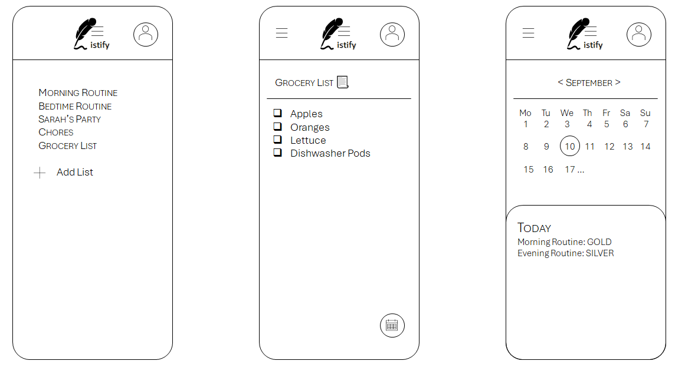

# Project Title: Listify

## Overview

Listify is a versatile list management app designed to be your all-in-one tool for organizing tasks, events, and daily routines. It allows users to create, organize, and share multiple lists for various needs, whether personal or collaborative. From managing everyday tasks to planning events or keeping track of personal routines, Listify simplifies organization and enhances productivity by bringing all your lists into one accessible platform.

### Problem Space

Staying organized and managing multiple responsibilities can be overwhelming, especially when juggling personal tasks, group activities, and daily routines. Existing list apps often focus on single use cases, like basic to-do lists, and lack features that support group collaboration or personalized self-care routines. Users need a tool that can manage not only shared responsibilities but also support personal goals and habits.

Listify addresses this gap by offering a comprehensive solution that integrates both shared and personal list management. Users can create and collaborate on lists for group tasks, such as planning events or managing shared chores, while also maintaining personal routines like morning and bedtime checklists. Listify’s customizable features and motivational elements, such as personalized reminders and achievement rewards, ensure that users stay on track and motivated, making it more than just a list app—it’s a tool for life management.

### User Profile

## Target Audience: Who Will Use Listify?

Listify is designed for anyone seeking to streamline their day-to-day tasks and enhance both personal and group organization. Key users include:

- **Families and Households**: Members who need a central hub for managing household chores, shared responsibilities, and family activities.
- **Event Planners and Social Organizers**: Individuals or groups who need a collaborative space to track contributions, plan events, and coordinate tasks.
- **Individuals Focused on Self-Care and Personal Routines**: Users looking to manage their daily routines, set personal goals, and track self-care habits in an engaging way.
- **Professionals and Students**: Those who need to manage multiple lists for work, study, or personal projects, with the flexibility to share and collaborate with others.

## How They Will Use It:

- **Creating and Sharing Lists**: Users can create lists for any purpose, keep them private or share them with others, and collaborate in real-time to add, edit, or check off items.
- **Routine Management**: Users can set up personalized morning and bedtime routines, receive reminders, and track their progress with motivational rewards like stars.
- **Group Collaboration**: Listify allows users to work together on shared lists for tasks like event planning, group projects, or coordinating household duties.

## Special Considerations:

- **User-Friendly Interface**: The app is designed to be intuitive and easy to navigate, with clear visual cues and straightforward list management features that cater to all tech skill levels.
- **Data Privacy and Security**: With options for both personal and shared lists, it’s essential that Listify ensures user data is protected, with secure sharing options and privacy controls.
- **Motivational Elements**: To keep users engaged, Listify includes gamification features like star rewards and personalized reminders to motivate users to achieve their personal goals.
- **Cross-Platform Compatibility**: Accessible across devices (mobile, tablet, and desktop) to ensure that users can manage their lists anytime, anywhere.

### Features

- **Create Multiple Lists**: Users can create and manage various lists for different needs, whether for personal tasks or group projects.
- **Shared and Personal Lists**: Seamlessly switch between personal and shared lists, allowing users to collaborate on group tasks or maintain privacy for individual lists.
- **Routine Management**: Set up morning and night routines and track progress, earning rewards for completing personal goals.
- **Real-Time Collaboration**: Collaborate on shared lists in real-time, with the ability to add, edit, or check off items together.

## Implementation

### Tech Stack

#### **Frontend:**
  - React
  - JavaScript

#### **Backend:**
  - Node.js
  - Express
  - MySQL

- **Client Libraries:**
  - react
  - react-router
  - axios

- **Server Libraries:**
  - express
  - knex

### APIs

- **No external APIs at the moment**

### Sitemap

- **Login page**
- **Sign-up page**
- **Home page** - contains all active lists
- **Add new list form**
- **Calendar page**

### Mockups



### Endpoints

**GET /lists/**

- Retrieve all active lists for a user.

Response:
```json
[
    {
        "id": 1,
        "add_new": true,
        "list_active": [
            {
                "id": 1,
                "name": "Grocery List"
            },
            {
                "id": 2,
                "name": "Sarah's Party List"
            },
            {
                "id": 3,
                "name": "Morning Routine"
            },
            {
                "id": 4,
                "name": "Night Routine"
            }
        ]
    }
]
```
**GET /lists/:id**

- Retrieve a specific list based on the ID. For example, when a user clicks "Grocery List," it will get the grocery list.

Response:
```json
[
    {
        "id": 1,
        "list_name": "Grocery List",
        "list_items": [
            {
                "id": 1,
                "name": "Coffee",
                "category": "Breakfast"
            },
            {
                "id": 2,
                "name": "Water",
                "category": "Beverage"
            },
            {
                "id": 3,
                "name": "Lettuce",
                "category": "Produce"
            }
        ]
    }
]
```

**GET /routinestats**

- Retrieve routine stars based on the user's compelted routines

Response:
```json
[
    {
        "id": 1,
        "date": "Sept 21, 2024",
        "routine": {
            "morning": "goldStar.png",
            "night": "silverStar.png"
        }
    }
]
```

## Roadmap

- **Create client**: Set up React project with initial routes and pages.
- **Create server**: Set up Express backend with routing.
- **Create migrations**: Design database schema and migrations.
- **Create seeds**: Populate database with sample data.
- **Deploy**: Deploy client and server projects to a live environment.
- **Feature Development**: Implement features for list creation, collaboration, routine tracking, and more.
- **Bug fixes**: Regular updates and maintenance.
- **Demo Day**: Showcase app functionality.

## Future Implementations

- **User Authentication**: Implement sign-up and login functionalities.
- **Enhanced List Features**: Integrate additional features like task prioritization, notifications, and reminders.

