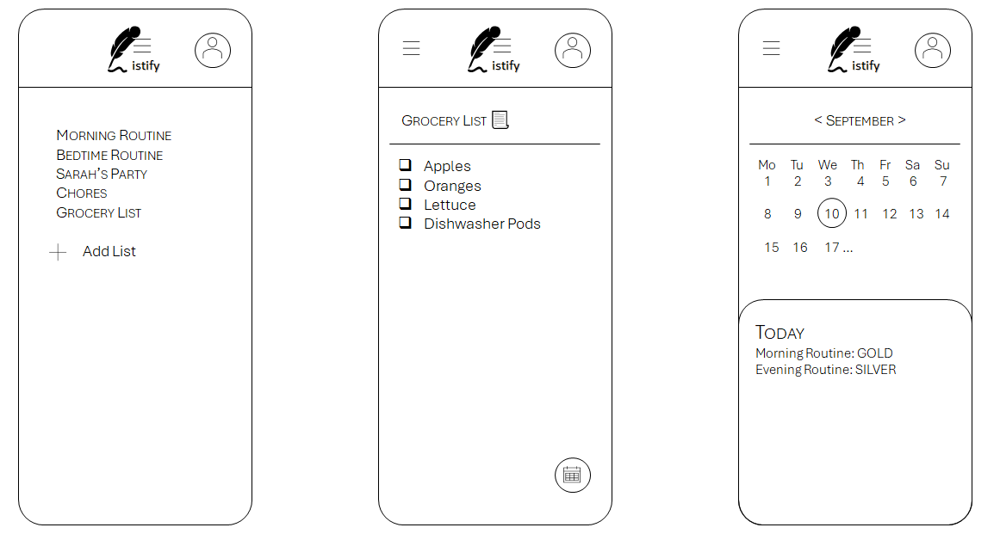

# Project Title

## Overview

Listify is a one place for all your lists! It allows users to create, organize, and share multiple lists for various tasks, events, and everyday needs. Whether you are going grocery shopping, planning a party, managing household chores, or keeping track of personal tasks, Listify simplifies collaboration and helps keep everyone on the same page. 

### Problem Space

In today's busy world, managing tasks, coordinating events, and staying organized can be overwhelming. With so much going on, it’s easy to forget about personal well-being amidst the daily hustle. Many existing apps focus on specific list types, like groceries or to-do lists, without offering a holistic approach that supports both group coordination and personal care.

With Listify, not only can you streamline group tasks and event planning, but you can also prioritize yourself. The app allows you to design your own morning and bedtime routines, helping you stay on track with your self-care goals. Completing your routines earns you gold, silver, and bronze stars as rewards, adding a fun, motivational element. Plus, personalized reminders ensure you don’t forget to take time for yourself, helping you maintain a balanced lifestyle.

This comprehensive approach makes Listify more than just a list app—it’s a tool for managing life’s responsibilities while supporting your personal well-being.

### User Profile

## Target Audience: Who Will Use Listify?

Listify is designed for anyone looking to streamline their day-to-day tasks and enhance their personal and group organization. Key users include:

- Busy Families: Parents and family members who need a central hub for managing household chores, grocery shopping, meal planning, and shared responsibilities.
- Event Planners and Social Organizers: Individuals or groups planning parties, gatherings, or other events, who need a collaborative space to track contributions and tasks.
- Individuals Focused on Self-Care: Users who want to prioritize their personal routines, such as morning and bedtime rituals, and stay on track with their self-care goals.
- Professionals and Students: Those needing to manage multiple lists for work, study, or personal projects in an organized and accessible way.

## How They Will Use It:

- Creating and Sharing Lists: Users can create custom lists for any purpose, share them with others, and collaborate in real time to add, edit, or check off items.
- Routine Management: Individuals can set up personalized morning and bedtime routines, receiving reminders and motivational rewards as they achieve their goals.
- Event-Specific Coordination: Users planning events can create dedicated lists, such as party prep lists, where guests can see what’s needed and add their contributions.

## Special Considerations:

- User-Friendly Interface: The app must be intuitive and easy to navigate for users of all tech skill levels, with clear visual cues and straightforward list management.
- Data Privacy and Security: Given the collaborative nature, it’s crucial that user data is protected, with secure sharing options and privacy controls for personal routines and shared lists.
- Motivational Elements: The self-care aspect requires gamification elements like star rewards and personalized reminders to keep users engaged and motivated.
- Cross-Platform Compatibility: Listify should be accessible across devices (mobile, tablet, and desktop), ensuring users can manage their lists anytime, anywhere.
These considerations help ensure that Listify not only meets the organizational needs of its users but also supports their personal well-being in a fun and meaningful way.

### Features

- As a user, I want to create and manage multiple unrelated lists so that I can organize tasks, events, and personal items separately.
- As a user, I want to set up my morning and night routines and track my progress so that I can stay consistent and earn rewards for completing my self-care goals.
- As a user, I want to create lists with pre-filled items based on the list type so that I can quickly get started with common tasks like grocery shopping or event planning.
- As a user, I want to create a grocery list that I can share with my family so that we can collaboratively add items and keep track of what’s needed.

## Implementation

### Tech Stack

#### **Frontend:**
  - React
  - JavaScript

#### **Backend:**
  - Node.js
  - Express
  - MySQL

- **Client Libraries:**
  - react
  - react-router
  - axios

- **Server Libraries:**
  - express
  - knex

### APIs

No external APIs at the moment

### Sitemap

- Login page
- Sign up page
- Home page - contains all active lists
- Add new list form
- Calendar page

### Mockups



### Endpoints

**GET /lists/**

- Get all active lists for a user

Response:
```
[
    "id": 1,
    "list_name": "Grocery List",
    "list_active": [
        {
            "id": 1,
            "name": "Grocery List",
        },
        {
            "id": 2,
            "name": "Sarah's Party List",
        },
        {
            "id": 3,
            "name": "Morning Routine",
        },
        {
            "id": 4,
            "name": "Night Routine",
        },
        ...
    ]
]
```

**GET /lists/:id**

- Get a specific list based on the id. For example, when user clicks "Grocery List" will get grocery list

Response:
```
[
    "id": 1,
    "list_name": "Grocery List",
    "list_items": [
        {
            "id": 1,
            "name": "Coffee",
            "category": "Breakfast",
        },
        {
            "id": 2,
            "name": "Water",
            "category": "Beverage",
        },
        {
            "id": 3,
            "name": "Lettuce",
            "category": "Produce",
        },
        ...
    ]
]
```

**GET /routineStars/:id**

- Get grocery will organize the items based on category

Response:
```
[
    {
        "id": 1,
        "date": "Sept 21, 2024",
        "routine": [
            "morning": "goldStar.png",
            "night": "silverStar.png"
        ],
    },
    ...
]
```

## Roadmap

- Create client
    - react project with routes and boilerplate pages

- Create server
    - express project with routing

- Create migrations

- Create seeds with sample data

- Deploy client and server projects so all commits will be reflected in production

- Feature: Organize grocery list based on categories

- Feature: View routine stars
    - Implement view stars from calendar page
    - Create GET /routineStars/:id 

- Feature: Add new list
    - Add form input to create a new list

- Feature: Startup page (hard codded for the sprint)"
    - Sign Up button
    - Login button

- Feature: Home page:
    - Shows all active lists

- Feature: Calendar page:
    - Shows current month with STARS for morning and night routine rewards

- Bug fixes

- DEMO DAY!!!
---

## Future Implementations
- Have sign up / Login page function properly with correct authentication
- APIs to place order directly from Grocery List
